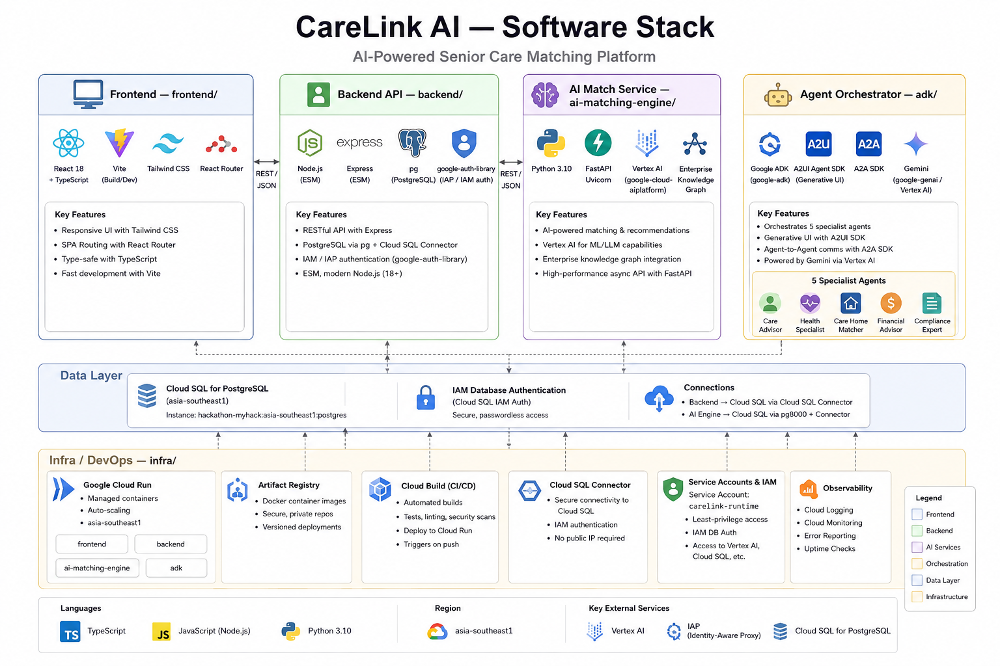

# CareLink AI

**Hospital ecosystem coordination, reimagined.**

An AI-powered hospital coordination platform that treats every clinical linkage — GP referral, surgical team assembly, allied health coordination — as a structured, governable, auditable relationship entity.

Built for **MyHack 2026 KL · Build With AI** against the Cradle problem statement on automating ecosystem linkages.

---

## The Problem

A single patient journey can require a GP, specialist, surgeon, anaesthetist, nursing team, physiotherapist, dietitian, pharmacist, coordinator, and payer context to align — fast.

Today that work is manual:

- a GP calls around to find a suitable specialist
- a surgical coordinator spends 30–45 minutes assembling an operating team
- ward staff page allied health teams without structured capacity or specialty matching
- outcome learning is lost after the case closes

**CareLink makes those relationships first-class system entities** — matched by AI, gated by compliance, stored with an audit trail, and improved by outcomes.

---

## Architecture



Four services on Google Cloud Run in `asia-southeast1`, one Cloud SQL for PostgreSQL data layer, all authenticated via IAM / Application Default Credentials — **zero static secrets**.

| Layer | Service | Stack |
|---|---|---|
| **Frontend** | `frontend/` | React 18 + TypeScript, Vite, Tailwind, React Router |
| **Backend API** | `backend/` | Node.js (ESM), Express, `pg` + Cloud SQL Connector, `google-auth-library` |
| **AI Match Service** | `ai-matching-engine/` | Python 3.10, FastAPI, Vertex AI, Enterprise Knowledge Graph |
| **Agent Orchestrator** | `adk/` | Google ADK, A2UI / A2A SDKs, Gemini via Vertex AI |
| **Data Layer** | Cloud SQL | PostgreSQL with IAM database authentication |
| **Infra** | `infra/` | Terraform, Cloud Build, Artifact Registry, Cloud Run |

The orchestrator runs **5 specialist agents** — Care Advisor, Health Specialist, Care Home Matcher, Financial Advisor, Compliance Expert — communicating over A2A and rendering inline UI via A2UI.

---

## Demo Journey

The demo follows **Encik Zainal, 58**, through three care stages:

1. **Referral matching** — GP Dr Amirul refers a suspected NSTEMI patient to the best-fit cardiologist. Matching considers specialty, payer, location, credential validity, capacity, and outcome history.
2. **Surgical team assembly** — the system assembles a CABG team for a 7am procedure. The Compliance agent blocks expired credentials and unavailable staff.
3. **Allied health coordination** — the ward coordinates post-CABG physiotherapy, dietetics, and pharmacy review. Outcomes are written back to the relationship records.

Every recommendation comes with an inspectable score breakdown (vector similarity + rule compliance + outcome weight) and a Gemini-generated clinical explanation.

---

## The Core Idea — Relationships as Entities

Every clinical linkage is a `Relationship`:

- who is connected
- which case triggered it
- what type of relationship it is
- whether compliance passed
- why the match was recommended
- what state it is in
- what outcome was recorded after completion

This turns hospital coordination into a programmable, auditable, reusable ecosystem graph.

---

## Repository Layout

```txt
.
├── frontend/              # React + Vite UI (3 matching screens, Copilot panel, graph)
├── backend/               # Node.js Express API, compliance gate, audit log
│   ├── src/               # Routes, services, db store
│   ├── migrations/        # PostgreSQL + pgvector schema
│   └── Dockerfile         # Cloud Run container
├── ai-matching-engine/    # FastAPI + Vertex AI embeddings + pgvector retrieval
├── adk/                   # Google ADK agents (orchestrator + 5 specialists)
│   ├── agents/            # Agent definitions
│   ├── tools/             # Backend API + retrieval tools
│   └── a2ui_surfaces/     # Generative UI components
├── infra/
│   ├── terraform/         # GCP project, IAM, service account, Artifact Registry
│   └── cloudbuild.yaml    # CI/CD pipeline
├── doc/
│   ├── architecture.png   # The diagram above
│   └── database-structure.md
└── CareLink_Team_Plan.md  # 24-hour build plan
```

---

## Backend API

| Endpoint | Purpose |
|---|---|
| `GET /health` | Service health check |
| `GET /openapi.json` | API contract |
| `GET /actors` · `POST /actors` | Clinical actors |
| `GET /cases` · `POST /cases` | Cases |
| `GET /relationships` · `POST /relationships` | Relationship entities (compliance-gated) |
| `PATCH /relationships/:id/state` | State transitions |
| `POST /match/referral` | Stage 1 — referral matching |
| `POST /match/surgical-team` | Stage 2 — team assembly |
| `POST /match/allied-health` | Stage 3 — allied health |
| `POST /outcomes` | Outcome write-back |
| `GET /audit` | Audit log |

Local dev runs against an in-memory seeded store; production reads/writes to Cloud SQL via the Cloud SQL Connector with IAM database authentication.

---

## Running Locally

### Backend

```powershell
cd backend
npm ci
npm run dev
```

Then:

```txt
http://127.0.0.1:8000/health
http://127.0.0.1:8000/openapi.json
```

Smoke test:

```powershell
npm run smoke
```

Verifies health, actor filtering, case creation, referral match, relationship creation, audit log writes.

### Frontend

```powershell
cd frontend
npm ci
npm run dev
```

### ADK Agents

```powershell
cd adk
pytest
```

---

## Cloud Deployment

Infrastructure is Terraform-managed:

```powershell
cd infra/terraform
terraform init
terraform plan  -var="project_id=YOUR_GCP_PROJECT_ID"
terraform apply -var="project_id=YOUR_GCP_PROJECT_ID"
```

This creates the `carelink-runtime` service account, runtime IAM bindings, and the `carelink-images` Artifact Registry repo, and enables the required APIs:

> Vertex AI · Cloud SQL Admin · Enterprise Knowledge Graph · Cloud Run · IAP · Identity Platform · Cloud Build · Artifact Registry · Cloud Logging · Cloud Monitoring · Cloud Trace · Cloud Tasks

Backend deploys via Cloud Build (`infra/cloudbuild.yaml`) on push.

---

## Security Model

CareLink is designed to be **secret-free**.

- no API keys committed
- no service-account JSON files
- no database passwords anywhere in code or env
- every Cloud Run service runs as `carelink-runtime`
- service-to-service auth is Application Default Credentials
- Cloud SQL connections use **IAM database authentication** (`enable_iam_auth=true`)
- end-user auth via Identity Platform / IAP

`git grep -i 'api_key\|password\|secret'` should return nothing meaningful — this is part of the pitch.

---

## What's Implemented

- ✅ Backend API scaffold with all routes, compliance gate, audit log
- ✅ PostgreSQL + `pgvector` schema and migrations
- ✅ Cloud SQL integration via the Cloud SQL Connector + IAM auth
- ✅ Frontend screens (referral / surgical / allied health) with score breakdown
- ✅ ADK orchestrator + 5 specialist agents with A2UI generative surfaces
- ✅ Terraform-managed GCP infra, Cloud Build pipeline, deployed Cloud Run services
- ✅ Seeded demo journey for Encik Zainal

---

## Project Thesis

The hospital's network is one of its most valuable operational assets. Today, much of that network exists only in the memory of experienced coordinators.

**CareLink makes that network programmable** — every relationship created with context, checked for compliance, stored with an audit trail, and improved by outcomes.
