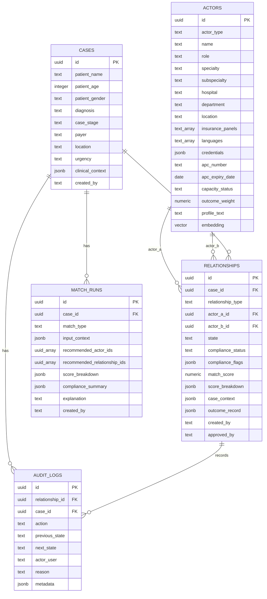
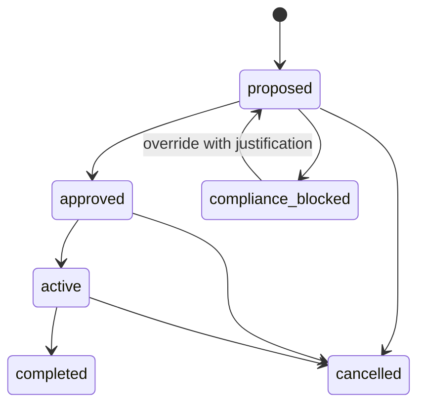
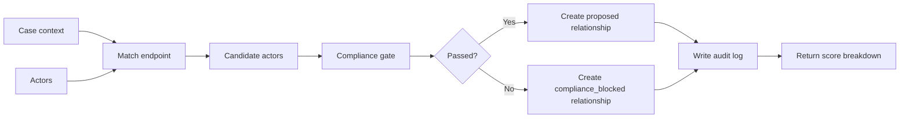

# CareLink Database Structure

This document describes the backend database structure used by CareLink. The schema is implemented in `backend/migrations/001_init.sql` and targets Cloud SQL for PostgreSQL with the `pgvector` extension.

## Purpose

CareLink models hospital coordination as relationship data. Instead of only storing doctors or appointments, the system stores the operational links between people, teams, cases, compliance decisions, matching results, and outcomes.

The database supports four main demo needs:

- store clinical actors such as GPs, specialists, surgeons, nurses, and allied health staff
- store patient case context for the care journey
- create relationship records between actors for each case
- track matching decisions, compliance checks, audit logs, and outcome feedback

## Entity Relationship Diagram



## Tables

### `actors`

Stores the ecosystem participants that can be matched or linked together.

Examples:

- GP
- cardiologist
- cardiothoracic surgeon
- anaesthetist
- nurse
- physiotherapist
- dietitian
- pharmacist
- hospital department

Important fields:

| Field | Purpose |
|---|---|
| `actor_type` | Broad actor category, such as `gp`, `specialist`, `surgeon`, or `physiotherapist`. |
| `role` | Matching role used by backend endpoints, such as `cardiologist` or `anaesthetist`. |
| `specialty` / `subspecialty` | Clinical matching metadata. |
| `insurance_panels` | Used to match payer requirements such as Prudential BSN. |
| `credentials` | JSON document for MMC, NSR, certifications, and other credentials. |
| `apc_expiry_date` | Used by the compliance gate to block expired APC matches. |
| `capacity_status` | Used to avoid matching unavailable actors. |
| `outcome_weight` | Weight used by matching to prefer actors with better historical outcomes. |
| `embedding` | `VECTOR(768)` field for Vertex AI `text-embedding-005` embeddings. |

### `cases`

Stores the patient journey context. This is intentionally smaller than a full electronic medical record. It only keeps the context needed to coordinate ecosystem relationships.

For the demo, the hero case is:

- patient: Encik Zainal
- age: 58
- diagnosis: NSTEMI
- journey: referral to CABG team to allied health coordination

Important fields:

| Field | Purpose |
|---|---|
| `patient_name`, `patient_age`, `patient_gender` | Demo-visible patient context. |
| `diagnosis` | Primary clinical problem, such as NSTEMI. |
| `case_stage` | Current stage: `referral`, `surgical_team`, `allied_health`, or `outcome_logged`. |
| `payer` | Insurance or payment context. |
| `clinical_context` | Flexible JSON for symptoms, timing, bed number, procedure, or notes. |

### `relationships`

This is the core CareLink table. A relationship represents a coordination link between two actors for a specific case.

Examples:

- GP to cardiologist referral
- surgeon to anaesthetist
- surgeon to CABG team member
- ward to physiotherapist
- care team to outcome feedback

Important fields:

| Field | Purpose |
|---|---|
| `case_id` | The patient case this relationship belongs to. |
| `actor_a_id` | Source actor in the relationship. |
| `actor_b_id` | Target actor in the relationship. |
| `relationship_type` | Business meaning of the link. |
| `state` | Workflow state such as `proposed`, `approved`, `active`, `completed`, or `compliance_blocked`. |
| `compliance_status` | Whether the relationship passed or failed compliance checks. |
| `compliance_flags` | JSON explanation of compliance checks. |
| `match_score` | Overall matching score. |
| `score_breakdown` | Explainable score components for the UI. |
| `outcome_record` | Outcome feedback after care is completed. |

### `audit_logs`

Stores traceability for governance and demo trust. Every important relationship event should write an audit log.

Examples:

- relationship created
- compliance passed
- compliance blocked
- state changed
- outcome logged
- override requested

Important fields:

| Field | Purpose |
|---|---|
| `relationship_id` | Relationship affected by the event. |
| `case_id` | Case affected by the event. |
| `action` | Type of event. |
| `previous_state`, `next_state` | State transition tracking. |
| `actor_user` | Authenticated user from IAP or local dev mode. |
| `reason` | Human-readable reason for the event. |
| `metadata` | JSON payload with compliance or outcome details. |

### `match_runs`

Stores matching results so the frontend and Copilot can explain what happened.

Examples:

- referral match
- surgical team match
- allied health match

Important fields:

| Field | Purpose |
|---|---|
| `match_type` | `referral`, `surgical_team`, or `allied_health`. |
| `input_context` | Request context passed to the match endpoint. |
| `recommended_actor_ids` | Actors recommended by the matching engine. |
| `recommended_relationship_ids` | Relationships created from the match run. |
| `score_breakdown` | Vector, rule, and outcome scoring explanation. |
| `compliance_summary` | Overall compliance result. |
| `explanation` | Text explanation for UI and Copilot. |

## Relationship State Machine



Recommended states:

| State | Meaning |
|---|---|
| `proposed` | Relationship was recommended but not yet approved. |
| `compliance_blocked` | Compliance gate blocked the relationship. |
| `approved` | User approved the proposed relationship. |
| `active` | Relationship is currently operational. |
| `completed` | Care coordination finished and outcome may be logged. |
| `cancelled` | Relationship was rejected or stopped. |

## Matching and Compliance Flow



The score breakdown should remain explainable:

| Score Component | Meaning |
|---|---|
| `vector_similarity` | Semantic match from actor profile embeddings. |
| `rule_compliance` | Whether hard rules passed. |
| `outcome_weight` | Historical outcome weighting. |
| `deterministic_demo` | Indicates current seeded demo fallback logic. |

## PostgreSQL Extensions

The migration enables:

```sql
CREATE EXTENSION IF NOT EXISTS pgcrypto;
CREATE EXTENSION IF NOT EXISTS vector;
```

Purpose:

- `pgcrypto` provides `gen_random_uuid()` for UUID primary keys.
- `vector` enables the `VECTOR(768)` actor embedding column for `pgvector` similarity search.

## Indexes

The migration includes indexes for common demo queries:

| Index | Supports |
|---|---|
| `idx_actors_role` | Role filtering for match endpoints. |
| `idx_actors_specialty` | Specialty filtering. |
| `idx_actors_capacity_status` | Availability filtering. |
| `idx_actors_apc_expiry_date` | Compliance checks for expired APC. |
| `idx_cases_stage` | Journey-stage filtering. |
| `idx_relationships_case_id` | Case graph and journey view. |
| `idx_relationships_state` | Workflow filtering. |
| `idx_relationships_actor_a`, `idx_relationships_actor_b` | Relationship graph traversal. |
| `idx_audit_logs_relationship_id`, `idx_audit_logs_case_id` | Governance and audit view. |
| `idx_match_runs_case_id` | Match history for a case. |

After embeddings are loaded, create the vector index:

```sql
CREATE INDEX idx_actors_embedding
ON actors
USING ivfflat (embedding vector_cosine_ops)
WITH (lists = 100);
```

## Demo Data Expectations

For the hackathon demo, the database should include:

- Encik Zainal case
- Dr Amirul as GP
- at least one cardiologist for NSTEMI referral
- Dr Suresh or another CABG surgeon
- anaesthetist, nurse, and allied health actors
- one expired-APC actor to demonstrate compliance blocking
- realistic Malaysian names, locations, insurance panels, and credentials

## Backend API Mapping

| API Endpoint | Main Tables Used |
|---|---|
| `GET /actors` | `actors` |
| `POST /actors` | `actors` |
| `GET /cases` | `cases` |
| `POST /cases` | `cases` |
| `GET /relationships` | `relationships` |
| `POST /relationships` | `relationships`, `actors`, `cases`, `audit_logs` |
| `PATCH /relationships/{id}/state` | `relationships`, `audit_logs` |
| `POST /match/referral` | `cases`, `actors`, `match_runs`, optional `relationships` |
| `POST /match/surgical-team` | `cases`, `actors`, `match_runs`, optional `relationships` |
| `POST /match/allied-health` | `cases`, `actors`, `match_runs`, optional `relationships` |
| `POST /outcomes` | `relationships`, `audit_logs` |
| `GET /audit` | `audit_logs` |

## Security Notes

- Do not store API keys, database passwords, or service-account JSON files in the repository.
- Cloud Run should use the `carelink-runtime` service account.
- Local development may use seeded in-memory data.
- Cloud deployment should use Cloud SQL IAM authentication and Application Default Credentials.
- End-user identity is expected from IAP headers in deployed mode.
